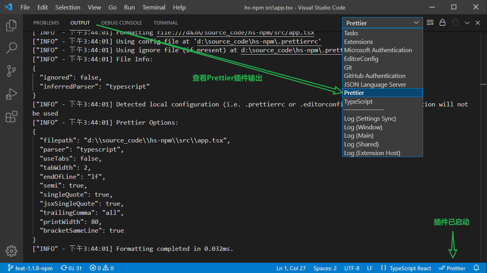

## 背景

- 痛点: 项目的代码写得太乱了，风格不统一。团队成员的编辑器格式化设置也不一样，经常在提交记录出现大量的格式化代码风格修改，影响日志追溯。
- 动机：npm script(prettier)似乎不起作用，虽然有 git hooks，项目也没有安装 eslint，也缺少 stylelint。
- 预期：团队统一代码风格，统一设置好编辑器，安装必要的编辑器插件，尽量用工具去自动整理代码
- 原则：让工具去管理规范，配置好相应的工具就行，让开发者少操心格式问题，把精力多放点在代码的实现
- 结果：预期想法基本满足。

<!-- more -->

## 工具的共性

1. node 包管理器安装依赖工具
2. 创建对应的配置文件
3. 编写 npm script 以便携使用
4. 下载扩展，设置对应的配置项以集成编辑器
5. git hooks 配置文件类型

1、2 是为了基本的正常使用；

3 是方便团队成员正确地使用工具；

4 是在编写代码的过程，能即使获得工具的检测反馈，以及在配置文件中拥有一定的代码提示，也能提供相应的编辑器命令以完成快捷操作。

5 是为了保证提交的代码格式都是正常的，团队成员的本地代码，随便折腾。这是最后的底线。

_这是一个基于`umijs`构建的项目，有些工具已经配置好的，检查已有的，补充需要的工具即可。_

## 准备工作

> 本文并不想讨论**代码规范**、**代码风格**、**代码格式**等术语之间的区别的联系，这仅仅是一次“**一站式自动整理代码**”的实践而已。

1. clone 另一份项目代码
2. 检出新的 git 分支
3. 备份 vscode 设置
4. vscode 禁用插件，还原用户设置
5. 新增编辑器项目级别的配置文件

```shell
mkdir .vscode
# 新建vscdoe的项目文件
touch .vscode/settings.json
# 此处用了一条关于vscode的命令行，指定扩展存储目录，以隔离之前下载的扩展
code . --extensions-dir .vscode/ext
```

_下列所有关于编辑器的设置全部都是项目级别的设置，建议直接编辑`.vscode/settings.json`文件以配置。_

## EditorConfig

EditorConfig 是最简单的，项目根路径下编写配置文件`.editorconfig`，安装插件即可——[EditorConfig for VS Code](https://marketplace.visualstudio.com/items?itemName=EditorConfig.EditorConfig)。

```
# http://editorconfig.org
root = true

[*]
indent_style = space
indent_size = 2
end_of_line = lf
charset = utf-8
trim_trailing_whitespace = true
insert_final_newline = true

[*.md]
trim_trailing_whitespace = false

[Makefile]
indent_style = tab
```

## prettier

### 安装

```shell
npm install --save-dev prettier
```

### 配置文件

`.prettierrc`

```json
{
  "semi": true,
  "singleQuote": true,
  "jsxSingleQuote": true,
  "trailingComma": "all",
  "printWidth": 80,
  "bracketSameLine": true,
  "overrides": [
    {
      "files": ".prettierrc",
      "options": { "parser": "json" }
    }
  ]
}
```

### npm script

`package.json`

```json
{
  ...
  "scripts": {
    "prettier": "prettier --write **/*.{js,jsx,tsx,ts,css,less,md,json}",
    "prettier:check": "prettier --check **/*.{js,jsx,tsx,ts,css,less,md,json}",
  }
}
```

两条`npm script`分别是使用`prettier`格式化代码（改动文件），以及使用 prettier 检测代码（不改动文件）。

**不建议立即将格式化后的代码马上提交到 git，若有改动，应丢弃更改。待到配置完所有的工具后，合并回到主要的分支后，在主要的分支执行此脚本，提交后，再通知团队成员拉取最新代码，以避免无妄之灾的合并冲突。**

_让 CI/CD 去执行脚本也行。_

### 编辑器集成

安装 vscode 的 prettier 插件，[Prettier - Code formatter](https://marketplace.visualstudio.com/items?itemName=esbenp.prettier-vscode)，并检查。



格式化代码：使用**编辑器命令（F1 / Ctrl + Shift + p)**，输入`Format Document`或者使用快捷键(Alt + Shift + F)。安装完插件后第一次格式化，编辑器会因为有**多种格式化方案**（编辑器内置、prettier 共两种）而让用户配置默认的方案。需要选择`prettier`。代码正确格式化时，会在上图的`OUTPUT` > `Prettier` 打印日志。

刚才的那个默认配置，会让编辑器自动在用户的配置添加默认格式化，编辑器命令`Preferences: Open Settings(JSON)`以检查，将`"editor.defaultFormatter"`相关的删除。（工具没配置好前，不要改变用户级别的配置！！）

```json
  "[typescriptreact]": {
    "editor.defaultFormatter": "esbenp.prettier-vscode"
  }
```

如果配置的话，应该在`.vscode/settings.json`中配置。

```json
"editor.defaultFormatter": "esbenp.prettier-vscode"
```

格式化时也可使用编辑器命令`Format Document With...`指定编辑器使用何种方式格式化。

## eslint

**`prettier`与`eslint`联系与区别。**

|      | eslint                                                                                                          | prettier                                                                         |
| ---- | --------------------------------------------------------------------------------------------------------------- | -------------------------------------------------------------------------------- |
| 文件 | 检测 js 语法，针对的是 js(x),ts(x)的文件。（非 js(x),ts(x)的文件，eslint 也是能检测的，只是这完全是愚蠢的做法） | 除了能前者，还支持 html/xml/Vue/Angular、css/less/scss/、Markdown 等一系列文件。 |
| 定位 | 格式化与代码质量检测                                                                                            | 只格式化代码，**无代码质量检测能力**                                             |
| 生态 | 很多规则，很多插件、扩展……                                                                                      | 少量的规则，极少的插件和扩展                                                     |

不管怎么看，eslint 除了兼容文件这一块，似乎都完爆 prettier。那么我们为什么还需要 prettier 呢？

事实上，eslint 比 prettier 还早出现，问题在于，eslint 关于格式化的规则太多了，开发者都在吵到底应该怎么配置格式化的规则。这在我看来完全是被工具给限制住了。后来就 prettier 就站出来：你们别吵了，我这边就提供这些关于格式化的配置给你们，你们就这么配置就行了， eslint 也继续用。

现在更多的是流行`prettier`组合`eslint`一起使用，前者负责代码格式化，后者负责质量检测，互不打扰。

[Prettier vs. Linters · Prettier](https://prettier.io/docs/en/comparison.html)

_事实上 prettier 跟 eslint 结合使用会有一小部分冲突的，但是这也是能通过安装扩展、配置去解决。_

### 基本使用

```shell
# 安装
npm install eslint --save-dev
# 初始化eslint，根据实际情况选择
./node_modules/.bin/eslint --init

? How would you like to use ESLint? ...
  To check syntax only
> To check syntax and find problems
  To check syntax, find problems, and enforce code style

? What type of modules does your project use? ...
> JavaScript modules (import/export)
  CommonJS (require/exports)
  None of these

? Which framework does your project use? ...
> React
  Vue.js
  None of these

? Does your project use TypeScript? » No / Yes √

? Where does your code run? ...  (Press <space> to select, <a> to toggle all, <i> to invert selection)
√ Browser √
√ Node

? What format do you want your config file to be in? ...
  JavaScript
  YAML
> JSON

Local ESLint installation not found.
The config that you've selected requires the following dependencies:
# eslint的初始化脚本根据刚才用户的选择，将采用下列依赖包
# 选择Yes，将会安装，并自动生成配置文件，选择No——白给
eslint-plugin-react@latest @typescript-eslint/eslint-plugin@latest @typescript-eslint/parser@latest eslint@latest
? Would you like to install them now with npm? » No / Yes √
```

### 结合 prettier

先别急着使用 eslint，使用之前还需要 eslint 结合 prettier——禁用 eslint 中关于代码格式的规则，让 prettier 去接管即可——[eslint-config-prettier](https://github.com/prettier/eslint-config-prettier/)

```shell
npm install --save-dev eslint-config-prettier
```

更新 eslint 配置。

```json
{
  "extends": ["some-other-config-you-use", "prettier"]
}
```

目前为止`.eslintrc.json`长这样，`rules`是针对项目的情况，暂时屏蔽错误才加的。

```json
{
  "env": {
    "browser": true,
    "es2021": true
  },
  "extends": [
    "eslint:recommended",
    "plugin:react/recommended",
    "plugin:@typescript-eslint/recommended",
    "prettier"
  ],
  "parser": "@typescript-eslint/parser",
  "parserOptions": {
    "ecmaFeatures": {
      "jsx": true
    },
    "ecmaVersion": 2021,
    "sourceType": "module"
  },
  "plugins": ["react", "@typescript-eslint"],
  "rules": {
    "react/react-in-jsx-scope": 0,
    "react/jsx-uses-react": 0,
    "@typescript-eslint/no-explicit-any": 0,
    "@typescript-eslint/no-unused-vars": 0,
    "@typescript-eslint/ban-types": 0,
    "no-control-regex": 0,
    "@typescript-eslint/ban-ts-comment": 0,
    "no-empty": 0,
    "no-prototype-builtins": 0,
    "@typescript-eslint/no-empty-function": 0,
    "prefer-const": 0,
    "react/display-name": 0,
    "@typescript-eslint/no-non-null-asserted-optional-chain": 0,
    "@typescript-eslint/no-non-null-assertion": 0,
    "react/prop-types": 0,
    "no-empty-pattern": 0,
    "no-fallthrough": 0,
    "react/no-children-prop": 0,
    "no-unsafe-optional-chaining": 0,
    "react/jsx-key": 0
  }
}
```

`.eslintignore`忽略掉一些不需要格式化的目录。

```
.vscode
dist
build
node_modules
```

### 配置文件中的`extends`、`plugins`字段

[Plugins](https://eslint.org/docs/user-guide/configuring/plugins)——针对解析器的相关的，配置解析器以解析不同文件。

[extends](https://eslint.org/docs/user-guide/configuring/configuration-files#extending-configuration-files)——继承指定配置文件的所有特性（规则、插件、语言选项）。

配置推荐[eslint-config](https://www.npmjs.com/search?q=eslint-config)

插件推荐[eslint-plugin](https://www.npmjs.com/search?q=eslint-plugin)

### npm script

```json
{
  "scripts": {
    "lint": "eslint --fix **/*.{js,jsx,ts,tsx}",
    "lint:check": "eslint **/*.{js,jsx,ts,tsx}"
  }
}
```

### 集成编辑器

安装[ESLint](https://marketplace.visualstudio.com/items?itemName=dbaeumer.vscode-eslint)，如果有这个弹窗，选“Allow”即可。


```json
{
  // 始终在状态栏显示eslint状态
  "eslint.alwaysShowStatus": true,
  // 启用eslint格式化
  "eslint.format.enable": true,
  // 编辑器默认格式化方案
  "editor.defaultFormatter": "esbenp.prettier-vscode",
  // 指定语言默认格式化方案
  "[javascript]": { "editor.defaultFormatter": "dbaeumer.vscode-eslint" },
  "[javascriptreact]": { "editor.defaultFormatter": "dbaeumer.vscode-eslint" },
  "[typescript]": { "editor.defaultFormatter": "dbaeumer.vscode-eslint" },
  "[typescriptreact]": { "editor.defaultFormatter": "dbaeumer.vscode-eslint" },
  // eslint格式化修复错误
  "eslint.codeActionsOnSave.mode": "all"
  // 保存时自动修复错误， 不建议
  // "editor.codeActionsOnSave": {
  //   "source.fixAll.eslint": true
  //   "source.fixAll.stylelint": true
  // },
}
```

因为`eslint`只支持`js(x)|ts(x)`，所以这里针对这几种语言做定制化，默认还是得使用`prettier`。

## Stylelint

“脚本家族”——`js(x)|ts(x)`有 eslint，“样式家族”——`css/less/sass/scss/SugarSS`等就由`stylelint`去保证代码质量，代码格式仍然是由`prettier`去接管。（也可以选择不结合使用 prettier）同样是需要安装，配置，然后使用合适的工具。

```
stylelint
postcss-less // less预处理语言语法
stylelint-config-standard // 标准配置
stylelint-config-css-modules  // css-modules相关规则
stylelint-config-rational-order // css规则排序
stylelint-config-prettier // 结合prettier
```

[stylelint-config-prettier](https://github.com/prettier/stylelint-config-prettier)是一个命令行工具，可以检测`stylelint`跟`prettier`的配置是否存在冲突。

```shell
npm i -D stylelint postcss-less stylelint-config-standard stylelint-config-css-modules stylelint-config-rational-order stylelint-config-prettier
```

配置文件 `.stylelintrc.json`

```json
{
  "extends": [
    "stylelint-config-standard",
    "stylelint-config-rational-order",
    "stylelint-config-css-modules",
    "stylelint-config-prettier"
  ],
  "customSyntax": "postcss-less",
  "rules": {
    "selector-class-pattern": null,
    "no-descending-specificity": null,
    "max-line-length": null,
    "function-url-quotes": null,
    "font-family-no-duplicate-names": null,
    "declaration-block-no-redundant-longhand-properties": null,
    "font-family-no-missing-generic-family-keyword": null,
    "declaration-block-no-duplicate-properties": null,
    "font-family-name-quotes": null,
    "property-no-unknown": null,
    "no-duplicate-selectors": null,
    "keyframes-name-pattern": null,
    "color-function-notation": "modern",
    "color-hex-alpha": "never",
    "block-closing-brace-empty-line-before": [
      "never",
      { "except": ["after-closing-brace"] }
    ]
  }
}
```

`npm script`

```json
{
  "scripts": {
    "stylelint-check": "stylelint-config-prettier-check",
    "stylelint": "stylelint --fix **/*.{css,less}",
    "stylelint:check": "stylelint **/*.{css,less}"
  }
}
```

`npm run stylelint-check`，先检测一下配置是否存在冲突。

```shell
$ npm run stylelint-check

> @ stylelint-check D:\source_code\hs-npm
> stylelint-config-prettier-check

Conflicting rule(s) detected in your stylelint configuration:
block-closing-brace-empty-line-before
npm ERR! code ELIFECYCLE
npm ERR! errno 1
npm ERR! @ stylelint-check: `stylelint-config-prettier-check`
npm ERR! Exit status 1
npm ERR!
npm ERR! Failed at the @ stylelint-check script.
npm ERR! This is probably not a problem with npm. There is likely additional logging output above.
```

这里`stylelint`的 `block-closing-brace-empty-line` 跟`prettier`的规则冲突了，从配置中删除即可。

```shell
$ npm run stylelint-check

> @ stylelint-check D:\source_code\hs-npm
> stylelint-config-prettier-check

No conflicting rules detected in your stylelint configuration!
```

编辑器的集成同样是安装相应的插件[Stylelint](https://marketplace.visualstudio.com/items?itemName=stylelint.vscode-stylelint)，插件的配置，只需要设置默认格式化方案即可。如果想手动修复错误，可使用编辑器命令`stylelint.executeAutofix`（针对当前文件，一次性修复）。

```json
{
  "[css]": {
    "editor.defaultFormatter": "stylelint.vscode-stylelint"
  },
  "[less]": {
    "editor.defaultFormatter": "stylelint.vscode-stylelint"
  }
}
```

- [PostCSS plugin](https://stylelint.io/user-guide/usage/postcss-plugin/)

- [rules](https://stylelint.io/user-guide/configure#rules)

- [plugins](https://stylelint.io/user-guide/configure#plugins)

## 自动整理代码

**应该在格式化时修复错误还是保存时自动格式化？?**

最佳体验是**格式化时修复错误**，通过[Formatting Toggle](https://marketplace.visualstudio.com/items?itemName=tombonnike.vscode-status-bar-format-toggle)**切换保存是否格式化**。

在禁用保存时自定格式化的时候，也可以选择手动格式化修复错误。

`Formatting Toggle`需要设置`editor.defaultFormatter`配置，否则不生效！

**手动格式化推荐使用`Format Document With...`命令。（起码自己知道是这次操作是按照哪种格式化方案运行的。）**

## git hooks

工具经全部安装并配置完成，开发者的编辑器也有了相应的配置。这些只能保证目前还有以后，自己编写的代码规范是没问题的。团队开发中，还有其他成员的代码规范也要保证。这时候就需要使用 git hooks 才解决了，这是最后的一个把关。（或者团队成员会不配置编辑器、不装相应的扩展。但是只要有 git hooks，就一定能保证代码提交的格式没毛病。）

延续项目已经有的[lint-staged](https://github.com/okonet/lint-staged)、[yorkie](https://github.com/yyx990803/yorkie)，继续配置即可。

[lint-staged](https://github.com/okonet/lint-staged)可以对 git 暂存的文件进行 shell 操作，在提交代码前触发。相当于我们自己手动`npm run eslint/pretter/styleint`一次，只不过仅作用于即将要提交的文件。相比手动运行命令行格式化工具，`lint-staged`的速度会更快。

[Husky - Git hooks](https://typicode.github.io/husky/#/)是一个`git hooks`库，会在代码提交的时候触发一些动作。

> You can use it to **lint your commit messages**, **run tests**, **lint code**, etc... when you commit or push. Husky supports

`yorkie`fork 了`husky`，使用更加简单。

`package.json` 添加相应的配置。

```json
{
  "gitHooks": {
    "pre-commit": "lint-staged"
  },
  "lint-staged": {
    "*.{js?(x),ts?(x)}": [
      "eslint --fix",
      "prettier --parser=typescript --write"
    ],
    "*.{css,*.less}": ["stylelint --fix", "prettier --write"],
    "*.{md,json}": ["prettier --write"]
  }
}
```

使用命令行提交代码, `running pre-commit hook: lint-staged`表示运行了 git hooks，使用了`lint-staged，如此代码提交的时候，会自动格式化。

```shell
$ git commit -m 1
 > running pre-commit hook: lint-staged
[STARTED] Preparing...
[SUCCESS] Preparing...
[STARTED] Running tasks...
[STARTED] Running tasks for *.{js?(x),ts?(x)}
[STARTED] Running tasks for *.{css,*.less}
[STARTED] Running tasks for *.{md,json}
[SKIPPED] No staged files match *.{css,*.less}
[SKIPPED] No staged files match *.{md,json}
[STARTED] eslint --fix
[SUCCESS] eslint --fix
[STARTED] prettier --parser=typescript --write
[SUCCESS] prettier --parser=typescript --write
[SUCCESS] Running tasks for *.{js?(x),ts?(x)}
[SUCCESS] Running tasks...
[STARTED] Applying modifications...
[SUCCESS] Applying modifications...
[STARTED] Cleaning up...
[SUCCESS] Cleaning up...
[feat_1.1.8_npm be3198f] 1
 2 files changed, 3 insertions(+)
 create mode 100644 src/a.jsx
```

**lint 和 prettier 的执行顺序？**

个人理解应处理完错误后，再来整理代码，所以这里是先`lint`后`prettier`。

## 行尾结束符问题（LF/CRLF）

结论，使用 LF，配置好 git 还有 prettier 的规则就行。

添加`* text=auto eol=lf`到`.gitattributes`文件。

prettier 设置`endOfLine`规则为`"lf"`或者干脆不设置。

v2.0.0 起默认值从`auto`更改为的`lf`。

执行`prettier --write`。

提交代码，然后让团队的所有(windows)成员删除代码仓库，重新 clone，以保证所有的文件都以正常更新为`LF`。

[Options · Prettier](https://prettier.io/docs/en/options.html#end-of-line)

## 后续

工具的配置也已经完成了， 应跟团队成员交流，并试用规则是否不太苛刻。确定都同意后，方可合并回主要的分支。并且执行相应的`npm script`。

```shell
npm run lint
npm run stylelint
npm run prettier
```

如果有格式问题，处理完再提交。通知其他团队成员拉取最新代码。（重新 clone 也行，“行尾结束符问题”相关有讲过。）

[示例源码](https://github.com/screw-hand/demo-fragment/tree/main/004-code-style)

## 未提及的

- [ ] 提交规范

## 感悟

- 每个项目的 lint 工具跟编辑的插件都不太一样，建议是使用 VS Code[Workspaces](https://code.visualstudio.com/docs/editor/workspaces)特性，分别配置项目的设置、还有插件的使用状态，以提升开发体验。

- 规范是为了统一风格，是为了在追溯日志（git diff)、code review 的时候，能少一点关系格式的问题。

- 规范是一个很灵活且主观的问题，最重要的是团队的成员都能接受，工具应该是有加成效果，而不是限制所有人的枷锁。

- 想要获得比较省事的开发体验，前提还是要折腾编辑器和插件以及合理设置好他们的配置项。

- 工具去保持代码格式的下限，团队的意识形态去突破代码质量的上限。
