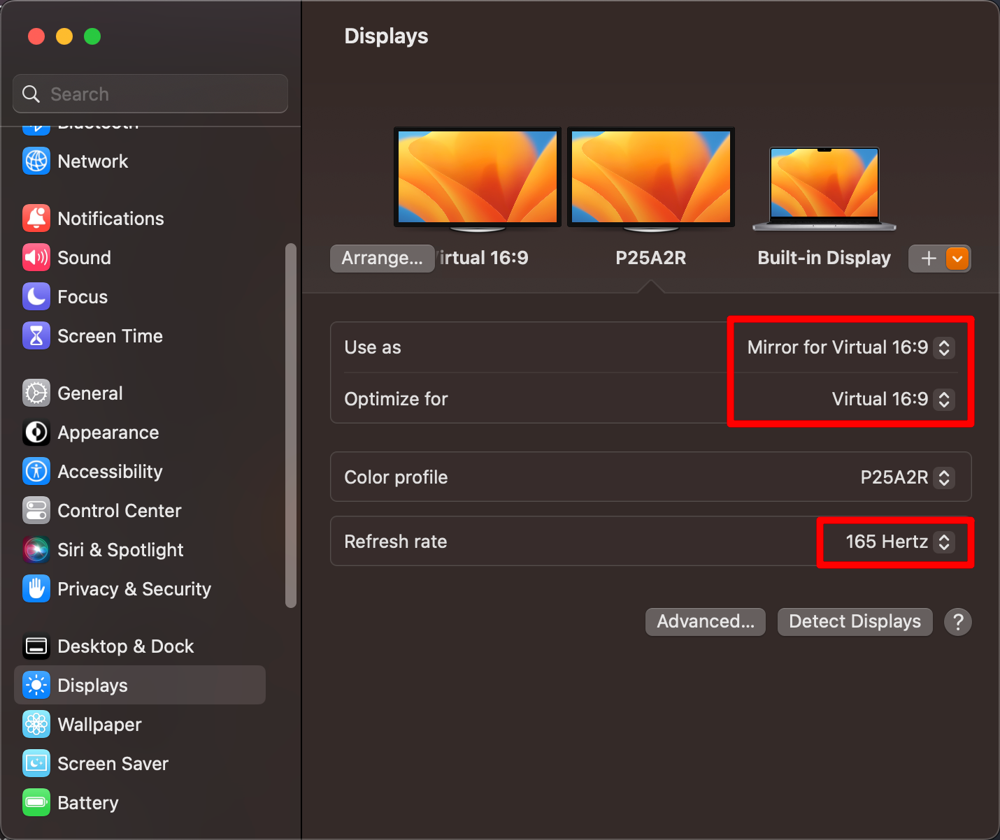

- 原生系统支持
- BetterDummy(BetterDisplay)

<!-- more -->
# 原生系统支持

这是推荐方案，下一章节的`BetterDummy(BetterDisplay)`有一些痛点。

macOS - 13.2.1 (22D68)可以直接设置，`Show all resolutions`提供更多的HiDPI分辨率，但肉眼反馈并不是所有标注HiDPI的分辨率都是真实的HiDPI，比如我最喜欢`2176*1224`。

# BetterDummy(BetterDisplay)

`BetterDummy`已更名为`BetterDisplay`.我使用的是`v2.2.1`，软件界面已经大变样，使用方式大同小异。
1. 将外接屏幕分辨率调整为默认
2. 创建新的虚拟屏幕
3. 系统设置，为外接屏幕设置为“镜像”虚拟屏幕
4. 在软件菜单中调整虚拟屏幕的分辨率
5. \*高刷屏设置最高刷新率（之前没有）

可参考该教程：[解决2K 显示器的尴尬！为MacBook 开启HiDPI（新方法支持M1）-zz的秘密基地](https://zzbloc.top/archives/turn-on-hidpi-for-macbook)

但是我并没有找到教程中“BetterDisplay，真正通过修改配置的方式打开原生的HiDPI”的方式，可能是`BetterDummy`才有功能。

缺点：
1. 造成输入法卡顿，重启相关软件或者输入法可解决问题
2. 偶现重置外接屏幕壁纸问题，因为虚拟屏幕的壁纸无法设置
3. 合上mac盖子，外接屏幕的软件会自动移动内置屏幕，或者反之，可以在合盖子前拔外接屏的屏幕线
4. 第三方软件和系统设置都可以设置分辨率，会造成外接屏幕实际使用时分辨率混乱问题
