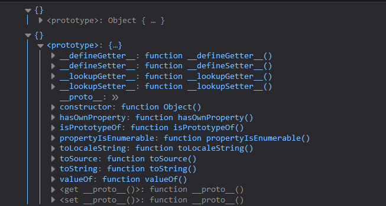
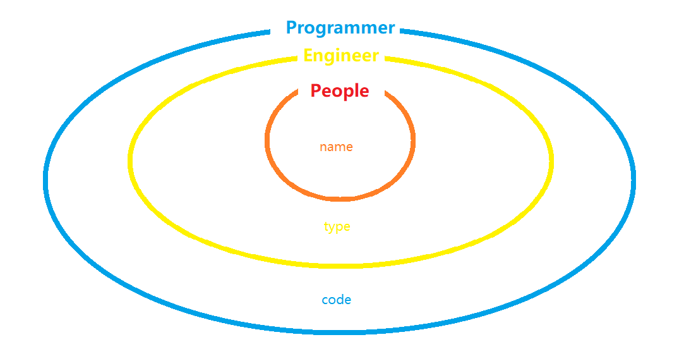

> 原型链是js的大动脉。

# 导读

js的原型链难以避免要牵扯到面向对象，这里我们先简单说说原型还有原型链。之后我们说到面向对象的演变过程，会再次涉及到原型链，还有更多的东西。相信看完的读者会对JavaScript会有更深的认识。

## 原型对象

本小节意在介绍js中几位朋友，读者只需要记住有它们的存在就行了，毕竟这几位朋友性格有点隐匿。

首先，我们要明白，声明一个对象，哪怕是空属性，js也生成一些内置的属性和方法。

```js
/* 两种方法声明对象 */
// 对象直接量
var obj_1 = {};
// new关键字声明对象
var obj_2 = new Object();

// 在Object的原型对象添加属性
Object.prototype.attr = 'myarr'

console.log(obj_1); // {}
console.log(obj_2); // {}

// js中的恒等符号对函数来说只比较引用
// obj_1.valuOf函数来源于Object.valueOf
// 更准确来说是Object.protoype.valueOf
console.log(obj_1.valueOf === Object.valueOf); // true

// obj_1并未声明attr属性，通过Object.prototype继承得到attr属性
console.log(obj_1.attr); // myarr
```

<!-- more -->


<p align="center">*firefox控制台中空对象仍然有`prototype`属性*</p>

  误区：每个浏览器的控制台输出都不太一样，Chrome和Edge并不显示`prototype`属性，因为我们并没有给obj_1的`prototype`属性定义任何属性和方法。
  由于历代浏览器的更新和ECMAScript的修正，有时难以体现`prototype`和`__proto__`的存在，但我们的js代码能体现出它们的确是真实存在的。

`prototype`在这里称之为`obj_1`的原型对象，通过对象直接量和`new`关键字声明的对象都具有原型对象，继承自`Object.prototype`；几乎每个对象都有其原型对象，null是特例。

## 双对象实现原型继承

需要原型对象是为了实现继承，但有了原型对象我们还无法把`obj_1`与`Object.prototype`链接起来。
我们还需要另一个对象：`__proto__`，该属性能指向构造函数的原形属性`constructor`。
一些老版本浏览器不识别，有些无法识别其内部信息，但不影响程序的正常运行。


<p align="center">*`obj_1`的`__proto__`对象, 该属性下又有`__proto__`和`constructor`属性*</p>

```js
obj_1.__proto__ === Object.prototype  // true
obj_1.__proto__.constructor === Object // true
```

这里有三个概念先行抛出
- 继承：继承使子类（超类）可拥有父类的属性和方法，子类也可添加属性和方法
- 父类：提供属性和方法被子类继承
- 子类：被父类继承的对象，可调用父类的属性和方法，也能定义属性和方法（父类无法调用）

通过`Object.prototype.attr`与`obj_1.attr`，我们可以看出 `obj_1` (子类) 继承了 `Object` (父类)的原型对象的`attr`属性。
正是因为`obj_1`的`__proto__`指向`Object.prototype`，obj_1继承了父类原型对象，使之拥有了`attr`属性。
而子类的`__proto__.constructor`直接指向父类。

> **原型继承：每声明一个对象，其本身拥有用两个对象：原型对象(`prototype`)，与`__proto__`对象，原型对象即可供自身使用，子类继承后也可调用；自身的`__proto__`对象指向父类的原型对象，其`constructor`属性指向父类的构造函数**。通过原型对象的方法实现继承，叫原型继承。

## 双对象与原型链

综合以上，我们知道了使用原型对象`prototype`和`__proto__`对象可以实现继承的功能。那么我们是不是可以一直继承下去呢？

```js
function People(name) {
  this.name = name;
}

function Engineer(type) {
  this.type = type;
}

Engineer.prototype = new People('Chris Chen'); // Engineer (子类)继承 People (父类)

function Programmer(skill) {
  this.skill = skill;
  this.showMsg = function () {
    return 'Hi, my name is ' + this.name + ', I am a ' + this.type + ' engineer, I can write ' + this.skill + ' code!';
  }
}

Programmer.prototype = new Engineer('front-end'); // Programmer (子类) 继承 Engineer (父类)

var me = new Programmer('js');

console.log(me); // Object { skill: "js", showMsg: showMsg() }
console.log(me.showMsg()); // Hi, my name is Chris Chen, I am a front-end engineer, I can write js code!
```

代码看完，我们从子类开始解释，也就是从下往上的顺序：
1. `me`是`Programmer`的实例化对象
2. `Programmer`的原型指向`Engineer`的实例对象
3. `Engineer`的原型指向`People`的实例对象

我们再来一张图说明其关系


*这个.. 一盘煎蛋？？*

好伐，煎蛋就煎蛋，来，我们继续。

请注意重点：**`Programmer`并无定义`type`, `name`属性，`Programmer`的`showMsg`中能显示`this.name` `this.type`分别来源于`Engineer`和`Programmer`的原型对象。**
很巧妙的一种属性搜索机制，**自身的构造函数没有该属性，就从自身的原型对象中找，如果父类的原型对象没有，那么继续往父类的父类原型对象找，找到了就赋值；或直到没有父类，返回`undefined`；**属性如此，方法也是同样的赋值机制。

说到底属性搜索机制就是原型链的一种具体体现，我们再上一张图。


所以原型链的关键字是**继承**和**原型对象**！！

> **原型链：使用`prototype`和`_proto_`两个对象实现继承，由于是基于原型对象实现调用链，又称之为原型链。**

关于原型链的第一步介绍就到这里，接下来我们从头开始，说说面向对象。

# 面向对象

首先我们先来概述面向过程编程（opp）与面向对象（oop）。这是JS的两种编程范式，也可以理解为编程思想。
顾名思义，两者的重心不同。下面我们使用两种方法创建dom并挂载于页面。

```js
/* 面向过程 */
// 1. 定义dom
var dom = document.createElement('div');
// 2. 设置dom属性
dom.innerHTML = '面向过程';
dom.id = 'opp';
dom.style = 'color: skyblue';
// 3. 挂载dmo
var container = document.getElementById('container');
container.appendChild(dom);

/* 面向对象 */
// 1. 定义构造函数
function CreateElement(tagName, id, innerText, style) {
  var dom = document.createElement(tagName);
  dom.innerHTML = innerText;
  dom.id = id;
  dom.style = style;
  this.dom = dom;
}
// 2. 定义原型对象上的方法
CreateElement.prototype = {
  render: function (dom) {
    var container = document.getElementById(dom);
    container.appendChild(this.dom);
  }
}

// 实例化对象
var innerBox = new CreateElement('div', 'oop', '面向对象', 'color: pink;');
// 调用原型方法
innerBox.render('container');
```

> 面向过程比较流水线，更注重程序的实现过程，面向对象的程序由一个又一个的单位————对象组成，不关心对象的内部属性和方法，只需实例化，调用方法即可使用。

或许上面的例子，还不是很有力得体现出两者的区别，那么如果现在，需要挂载多个元素呢？

```js
/* 面向过程 */
// var dom_1 = document.createElement('div');
// dom_1.innerHTML = '面向过程_1';
// dom_1.id = 'opp-1';
// dom_1.style = 'color: skyblue';

// var dom_2 = document.createElement('div');
// dom_2.innerHTML = '面向过程_2';
// dom_2.id = 'opp-2';
// dom_2.style = 'color: skyblue;';

// var container = document.getElementById('container');
// container.appendChild(dom_1);
// container.appendChild(dom_2);

/* 这种方法傻的可爱，我们包装成函数吧 */

function createElement(tagName, id, innerText, style) {
  var dom = document.createElement(tagName);
  dom.innerHTML = innerText;
  dom.id = id;
  dom.style = style;
  return dom;
}

var container = document.getElementById('container');
var box_1 = createElement('div', 'oop-1', '面向过程_1', 'color: skyblue;');
var box_2 = createElement('div', 'oop-2', '面向过程_2', 'color: skyblue;');
container.appendChild(box_1);
container.appendChild(box_2);

/* 面向对象 */
function CreateElement(tagName, id, innerText, style) {
  var dom = document.createElement(tagName);
  dom.innerHTML = innerText;
  dom.id = id;
  dom.style = style;
  this.dom = dom;
}
CreateElement.prototype = {
  render: function (dom) {
    var container = document.getElementById(dom);
    container.appendChild(this.dom);
  }
}

var innerBox_1 = new CreateElement('div', 'oop-1', '面向对象_1', 'color: pink;');
innerBox_1.render('container');

// 这里只需再实例化一个对象调用render方法即可
var innerBox_2 = new CreateElement('div', 'oop-2', '面向对象_2', 'color: pink;');
innerBox_2.render('container');
```

重复调用同样的方法，面向过程如果不包装一个函数，显得代码很冗余且愚蠢，而面向对象只需再次实例化即可。
这里也提醒我们平时写代码的时候要考虑复用性。

好的，那我们现在需要给dom元素添加一些交互功能，又要怎么做？

```js
/* 面向过程 */
function createElement(tagName, id, innerText, style, event, fn) {
  var dom = document.createElement(tagName);
  dom.innerHTML = innerText;
  dom.id = id;
  dom.style = style;
  // 直接修改内部函数
  dom.addEventListener(event, fn);
  return dom;
}

var container = document.getElementById('container');
var box_1 = createElement('div', 'oop-1', '面向过程_1', 'color: skyblue;', 'click', function (e) {
  alert(e.target.innerHTML);
});
// 过于死板，就算没有传参dom.addEventListener也会调用两次
var box_2 = createElement('div', 'oop-2', '面向过程_2', 'color: skyblue;');
container.appendChild(box_1);
container.appendChild(box_2);

/* 面向对象 */
function CreateElement(tagName, id, innerText, style) {
  var dom = document.createElement(tagName);
  dom.innerHTML = innerText;
  dom.id = id;
  dom.style = style;
  this.dom = dom;
}
CreateElement.prototype = {
  render: function (dom) {
    var container = document.getElementById(dom);
    container.appendChild(this.dom);
  },
  // 在原型对象上添加方法
  addMethod: function (event, fn) {
    this.dom.addEventListener(event, fn);
  }
}

var innerBox_1 = new CreateElement('div', 'oop-1', '面向对象_1', 'color: pink;', 'click');
innerBox_1.render('container');

var innerBox_2 = new CreateElement('div', 'oop-2', '面向对象_2', 'color: pink;', 'click');
innerBox_2.render('container');
// 根据场景需求决定是否调用addMethod方法
innerBox_2.addMethod('click', function (e) {
  alert(e.target.innerHTML);
})
```

从这里可以我们看出两者的扩展方法截然不同，面向过程模式需要直接在函数中修改，而面向对像在原型对象上直接追加方法。

> 面向对象比面向过程有更高的复用性和扩展性。

PS：面向过程也并非一无是处，比面向对象更直观化，也更理解。若不需要考虑太多的因素，使用面向过程开发反而效率会更快。

## 创建对象

把大象关进冰箱需要几步在下并不清楚。不过要想进行面向对象开发，第一步是先创建一个对象，js中有6种方法可创建对象：
1. new 操作符
2. 字面量
3. 工厂模式
4. 构造函数
5. 原型模式
6. 混合模式（构造+原型）

### 工厂模式

前两种方法在开头已使用，这里不再复述。如果要创建多个相同的对象，使用前两种方法，会产生大量重复的代码，而工厂模式解决了这个问题..

```js
function factoryMode(name, age) {
  var obj = new Object();
  obj.name = name;
  obj.age = age;
  obj.say = function () {
    return this.name + ' has ' + this.age + ' years old!';
  }
  return obj;
}

var guest = factoryMode('Gentleman', 25);
var Chris = factoryMode('Chris', 20);
console.log(guest.say()) // Gentleman has 25 years old!
console.log(Chris.say()) // Chris has 20 years old!

console.log(guest instanceof Object);  // true
console.log(Chris instanceof Object);  // ture
...
```

有点赞哦，这样**重复实例化多个对象**也不怕了，**对象识别**问题仍然没解决

PS:`new Object()`已决定了工厂模式的实例是由`Object`实例化而来的，其对象类型是`Object`，`Date` `Array`有对应的对象类型，这里读者可以试试`new Array instanceof Array`等原生数据类型。

> 工厂模式是面向对象中常见的一种设计模式，是一个可以重复实例化多个对象的函数，但识别对象无能为力。

### 构造函数

我们可以把工厂模式修改一下，就可以写出一个构造函数..

```js
function ConstructorMode(name, age) {
  this.name = name;
  this.age = age;
  this.say = function () {
    return this.name + ' has ' + this.age + ' years old!';
  }
}

var guest = new ConstructorMode('Gentleman', 25);
var Chris = new ConstructorMode('Chris', 20);
console.log(guest.say()) // Gentleman has 25 years old!
console.log(Chris.say()) // Chris has 20 years old!

console.log(guest instanceof Object); // true
console.log(guest instanceof ConstructorMode);  // true
console.log(ConstructorMode instanceof Object); // true
```

有几个地方不太一样：
1. 没有显示创建对象
2. 属性/方法赋值给`this`
3. 使用`new`关键字调用
4. 无`return`

可以看出实现了跟工厂模式一样的功能，那么什么是构造函数呢？
- 构造函数也是一个函数，跟工厂模式一样可重复实例化对象。为了跟普通函数区分，函数名首字母一般是大写的。
- 使用该函数时需要使用`new`关键字实例化；不使用`new`实例化，该构造函数表现如同普通的函数。
- 虽然没有显示创建对象，但在`new`实例化时，后台执行了`new Object()`
- 使用`this`是因为，构造函数的作用域指向实例化对象，即：两次实例化，`ConstructorMode`中的`this`分别指向`Guest`, `Chris`。

通过上面的`instanceof`判断，我们能识别出`guest`是由`ConstructoreMode`实例化的，与此同时 `guest` 也是 `Object` 的实例对象。
构造函数也有其弊端，声明在构造函数内的属性叫“构造属性”，问题就在于：构造属性若是引用类型（以函数为例），实例化后的函数执行的动作虽然是相同的，但引用地址不同，我们并不需要两份同样的函数。

```js
console.log(Chris.say == guest.say); // false
```

> 构造函数模式：构造函数是一个需要实例化调用的函数，内部作用域指向实例对象，无须return。构造函数模式，也可实例化大量重复对象，也可识别实例化后的对象是由哪个构造函数实例化而来。其缺点是：若在构造属性中声明函数，实例化后的各个对象引用地址保持独立。

### 原型模式

原型模式靠原型对象发挥作用，**原型对象**开头已有介绍。

```js
function PrototypeMdoe() {

}
// 直接在原型对象声明，直面量形式
PrototypeMdoe.prototype.mode = 'prototype';
PrototypeMdoe.prototype.do = function (name) {
  return 'we do the something same, ' + name + '.';
}

var guest = new PrototypeMdoe();
var Chris = new PrototypeMdoe();

console.log(guest.do('guest')) // we do the something same, guest.
console.log(Chris.do('Chris')) // we do the something same, Chris.
console.log(guest.do === Chris.do) // true，相同的引用指针
console.log(guest.do('guest') === Chris.do('Chirs')) // false， 返回值不相等

console.log(guest.prototype === Chris.prototype) // 指向相同的原型对象
```

实例化对象`do`方法引用指针是相同的，所以如果是需要给所有实例化对象**共享**的方法，可在原型上直接声明。`guest`和`Chris`都由**同一个构造函数的实例化**，**原型对象的指针地址相同**。

也可以使用对象字面量的方法，两者有点的区别：对象字面量声明的原型`constructor`会指向`Object`，我们也可以手动设置。

```js
function PrototypeMdoe() {

}
// 对象字面量，原型赋值为对象
PrototypeMdoe.prototype = {
  // 手动设置构造函数指针
  // constructor: PrototypeMdoe,
  run: function () {
    return 'I;m running!'
  }
}

var proto = new PrototypeMdoe()

// 打开constructor的注释对比运行结果
console.log(
  proto.constructor === PrototypeMdoe,
  proto.constructor === Object
)
```

> 原型模式：**共享**是原型对象的特点，所有声明在原型上的属性和方法都会**被所有实例化对象继承**，且指向同一个引用地址。

原型属性是基本类型的数据，共享很方便；如果是**引用类型**的数据，共享将带来麻烦。由于**引用地址相同**，**更改其中一个**实例的原型属性，其他实例的原型也**随之改变**。

```js
function PrototypeMdoe() {

}
PrototypeMdoe.prototype.arr = [1, 2, 3, 4, 5];

var proto_1 = new PrototypeMdoe();
var proto_2 = new PrototypeMdoe();

console.log(proto_1.arr)  // [1,2,3,4,5]
proto_1.arr.splice(1, 2)  // [2,3,4]
console.log(proto_2.arr)  // [1,5]
```


**Object.definedPeroperty**：ES5语法，可定义新属性或修改现有属性并返回改对象；第三个参数为属性描述符，能精确添加或修改对象的属性：枚举性、属性值、可写性、存取设置。

```js
var Obj = {
  attr: 'obj'
}

Obj.prototype = {
  run: function (name) {
    return name + ' run!';
  }
}

// 使用Object.definedPeroperty设置constructor的特性
Object.defineProperty(Obj.prototype, 'constructor', {
  configurable: true,     // 设置为ture下面的设置才能生效
  // enumerable: false,   // 枚举性
  // writable: false,     // 可写性
  // get: undefined,      // 取值器
  // set: undefined,      // 设置器
  value: Obj              // 属性值
})
```

`isPrototypeOf`函数可以判断**原型对象**是否为某个**实例**的原型对象。

```js
console.log(
  PrototypeMdoe.prototype.isPrototypeOf(proto_1), // true
  Array.prototype.isPrototypeOf(proto_1)          // false
)
```

### 混合模式

混合模式是组合构造函数和原型模式使用，这是最常用的一种设计模式了。

构造函数模式用于定义实例属性，而原型模式用于定义方法和共享的属性。
所以每个实例都会有自己的一份实例属性的副本，但同时共享着对方法的引用。
最大限度的节省了内存。同时支持向构造函数传递参数。

```js
function CreateObject (name, age) {
  this.name = name;
  this.age = age;
}

CreateObject.prototype.say = function () {
  return this.name + ' has ' + this.age + ' years old!';
}

var guest = new CreateObject('Gentleman', 25);
var Chris = new CreateObject('Chris', 20);
console.log(guest.say()) // Gentleman has 25 years old!
console.log(Chris.say()) // Chris has 20 years old!
```

`hasOwnProperty`可检测一个属性是否为实例属性。
而`in`可判断属性是否存在本对象中，包括实例属性或者原型属性。

```js

console.log(guest.hasOwnProperty('name')) // true
console.log(guest.hasOwnProperty('say'))  // false

console.log('name' in guest)  // true
console.log('say' in guest)   // true

// 判断是否为原型属性
function isProperty(object, property) {
  debugger
  return !object.hasOwnProperty(property) &&  property in object;
}

console.log(isProperty(guest, 'name'))
console.log(isProperty(guest, 'say'))
```

创建对象的六种方法就到这里了，另外还有**动态原型**、**寄生构造**、**稳妥构造函数**。 这三种模式都是基于混合模式的改良，感兴趣的可以随便看看：<a id="create-object" class="btn">点我查看</a>
<div id="other-create" style="display:none;">
  **动态原型**
  原型模式中，不管我们是否调用原型的方法，都会初始化原型中的方法，并且声明一个构造函数时，构造函数和原型对象是分开声明的，略显怪异。我们可以使用动态原型模式，把构造函数和原型对象封装到一起。

  ```js
function CreateObject (name,age) {
  this.name = name;
  this.age = age;
  // 动态创建原型属性，仅在第一次调用时初始化
  if (typeof this.say !== 'function') {
    CreateObject.prototype.say = function () {
      return this.name + ' has ' + this.age + ' years old!';
    }
  }
}

var guest = new CreateObject('Gentleman', 25);
var Chris = new CreateObject('Chris', 20);
console.log(guest)
console.log(guest.say()) // Gentleman has 25 years old!
console.log(Chris.say()) // Chris has 20 years old!
  ```
  <h4>寄生构造</h4>
  <h4>稳妥构造函数</h4>
</div>

<style>
#other-create {
  border: 5px solid #aaa;
}
</style>

<script>
;(function() {
  var showOtherCreate = true;
  var creatObject = document.getElementById('create-object');

  creatObject.addEventListener('click', function() {
    var otherCreate = document.getElementById('other-create');
    if (showOtherCreate) {
      otherCreate.style.display = 'block';
      creatObject.innerText = '不想看了';
    } else {
      otherCreate.style.display = 'none';
      creatObject.innerText = '点我查看';
    }
    showOtherCreate = !showOtherCreate;
  })
})();
</script>


### 动态原型


### 寄生构造


**未完待续**